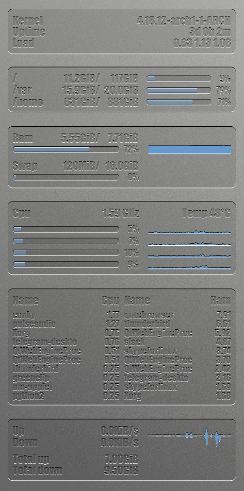
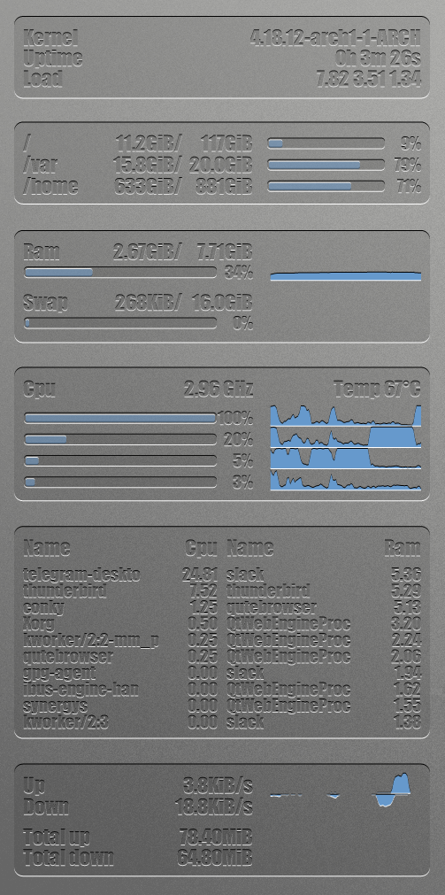

I feel finally comfortable enough sharing my conky\!

Here is what it looks like :

| Idle          | Busy          |
| ------------- | ------------- |
|  |  |

It is coded entirely in **lua**, using **cairo** bindings.  
Everything is displayed using transparency, so you can use it with your
own background. Light, homogeneous backgrounds are preferred.

Conky needs to be compiled with at least lua and cairo enabled, as can
be found in the `conky-lua` package in the
[AUR](https://aur.archlinux.org/packages/conky-lua)

# Install

To install, clone in `~/.config/conky/`, or the directory of your
choice.  
If you chose another directory, you’ll have to edit the `conky.rc` file
and change this line with your custom path:

    lua_load = '~/.config/conky/conky.lua',

# Configure

You can change the startup options of conky in `conky.rc`, though be
careful as many of them are used to compose with the actual desktop
background.  
The most important value to set is your screen resolution:

    minimum_width = 1920,
    minimum_height = 1080,

In `conky.lua`, you have to set some values specific to your system:

    -- SETTINGS
    nbCPU = 4
    FSs = {"/", "/var", "/home"}
    ladapter = "eth0" -- eno1
    wadapter = "wlan0"
    ntop = 10
    -- SETTINGS

  - *nbCPU* is your number of CPU/threads
  - *FSs* is a list of the filesystem mountpoints you want to monitor
  - *l/w* adapter are the names of the different interfaces you want to
    monitor
  - *ntop* is the number of processes you want to display in the top
    widget

You can go further in customization and place the widgets wherever you
want on the screen, set the color used for the bars, the font face and
size, etc.  
All the functions used to draw bars, history plots, embossed regions or
text are available to play with.

# Run

Run with

    conky -d -c ~/.config/conky/conkyrc
